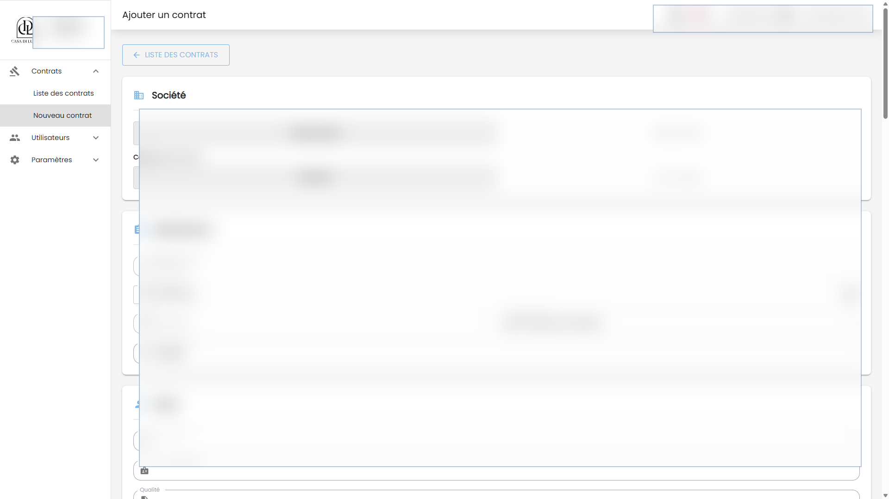

# Contracts Backend

Django REST API for a contract document platform for creating, managing, generating, editing, and tracking contract records, files, notifications, users, and document outputs.

This is a production-oriented business backend. It models real operational workflows, authenticated staff access, API filtering, document/report generation, realtime notification plumbing, and testable domain behavior.

## What It Shows

- Backend ownership for a complete internal business application.
- Django REST API design across related business modules.
- PostgreSQL data modeling for operational records and audit/history needs.
- Auth, permissions, SSO subject handling, filters, dashboards, exports, and realtime events.
- Testable backend code with pytest tooling instead of only manual checks.

## Main Modules

- account
- contract
- core
- notification
- ws

## Key Capabilities

- Django REST API for contracts, accounts, files, document generation, notifications, users, and websocket events.
- Document-generation stack with ReportLab, WeasyPrint, python-docx, OpenPyXL, num2words, and reusable core document helpers.
- JWT/session auth, SSO subject support, django-filter, django-axes, and permission-aware API views.
- PDF/DOCX-oriented business workflow support for contract lifecycle screens.
- pytest coverage around contract creation, document behavior, auth, and websocket middleware.

## Stack

- Python, Django 6, Django REST Framework
- PostgreSQL, django-filter, django-simple-history
- SimpleJWT, dj-rest-auth, django-axes, CORS
- Redis, Channels, channels-redis, Daphne, Celery-ready runtime
- Gunicorn, WhiteNoise, Pillow/OpenCV where media handling is needed
- pytest, pytest-django, pytest-cov, pytest-asyncio, pytest-xdist

## Related Repository

- Frontend: [Altroo/contracts_frontend](https://github.com/Altroo/contracts_frontend)

## Product Screenshots

Redacted production UI screens powered by this API. Sensitive names, amounts, dates, and records are blurred.




## Local Setup

Create local-only environment variables for Django settings, database, Redis, media/static storage, CORS, and allowed hosts. Do not commit `.env` files or production credentials.

```bash
python -m venv .venv
source .venv/bin/activate
pip install -r requirements.txt
python manage.py migrate
python manage.py runserver 8001
```

On Windows, activate with `.venv\Scripts\activate`.

## Tests

```bash
python -m pytest
python -m pytest --cov
```

## Portfolio Note

The repository is public for portfolio review. Screenshots are redacted, and sensitive production values are intentionally hidden.
